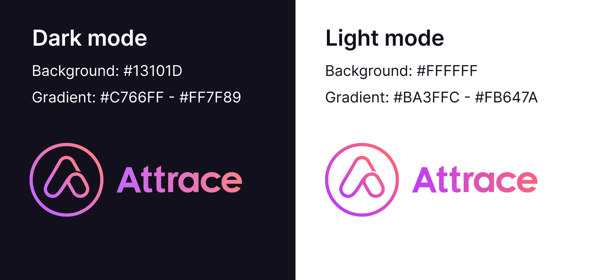

<h1 align="center">
   
  
   
  <a href="https://attrace.com">Attrace</a> Assets
   
</h1>

## Color modes

There are 2 different versions of Attrace logo - for dark mode and light mode.

### Dark mode _(primary)_:
* Gradient - #C766FF / #FF7F89
* Use on the background #13101D

### Light mode _(secondary)_:
* Gradient - #BA3FFC / #FB647A
* Use on the background #FFFFFF
### Usage in marketing materials
It is preferable to use a full dark mode (primary) logo on dark backgrounds (ideally #13101D).

E.g. png > darkmode > `logo-full-gradient-darkmode-***` files.

### Usage as avatars and the like
It is preferable to use a symbol dark mode (primary) logo with #13101D background.

E.g. png > darkmode > `logo-symbol-gradient-darkmode-withbg-***` files.

